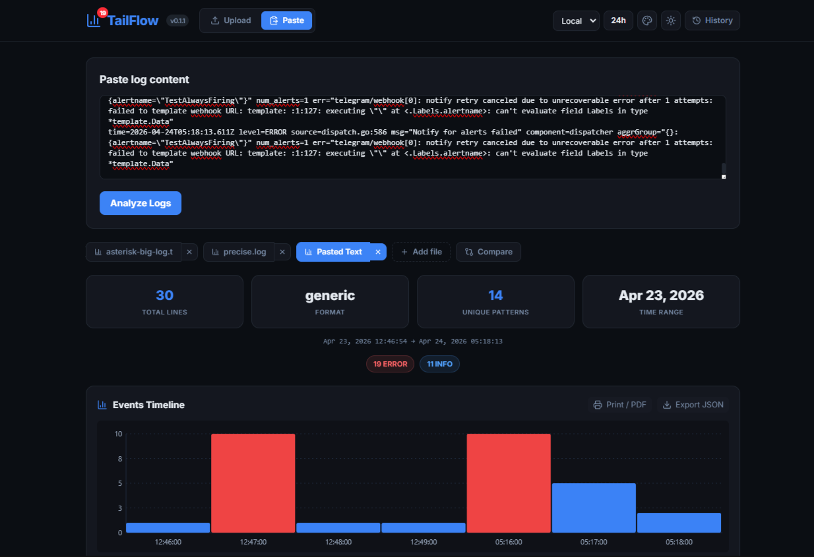

# TailFlow — Visual Log Parser for Humans

**Analyze, group and explore log files directly in the browser. No server, no database, no registration.**

 <!-- add a screenshot if available -->

## ✨ Features

- 🔍 **Auto-detection of log formats** — Asterisk, syslog, nginx/apache, and generic formats.
- 🧠 **Smart grouping** — normalization of IPs, UUIDs, numbers, query parameters to extract unique patterns.
- 📈 **Interactive histogram** — minute-level event distribution with tooltips; click a bar to see raw log samples.
- 🪣 **Drill-down details** — up to 15 raw log lines displayed per bucket.
- ✂️ **Click‑to‑copy** — click any raw log line in the detail modal to copy it to the clipboard.
- ⚖️ **Compare two analyses** — diff between the current and previous import, highlighting added/removed patterns.
- 📂 **File upload or paste** — drag & drop `.log`/`.txt` files or paste text (up to ~10 MB).
- 🌐 **Timezone support** — Local (browser) and UTC.
- 🕒 **12/24-hour time format** — toggle with one click.
- 🌓 **Dark and light themes** — comfortable in any lighting.
- 💾 **History** — last 10 analyses stored in `localStorage`.
- ⬇️ **JSON export** — export all groups and histogram data.
- 📱 **Responsive design** — works on desktop, tablet and mobile.
- ⚡ **Web Worker** — heavy parsing runs in a separate thread, UI stays responsive.

## 🚀 Try It Live

The app is deployed on **GitHub Pages**.  
👉 **[TailFlow](https://capwan.github.io/TailFlow/)** 

No cloning, no dependencies — just open the link and start analyzing logs.

## 🧩 How It Works

- Parsing is performed by a Web Worker, keeping the main thread free.
- The parser detects the timestamp format and splits the file into logical blocks.
- Each block is normalized: IPs → `<IP>`, numbers → `<N>`, UUIDs → `<UUID>`, etc. This groups similar messages together.
- A minute-resolution histogram is built from the timestamps.
- The UI is reactive: filtering, timezone/format changes, and theme switching update the display instantly.

## 🛠️ Development

- The code is split into `index.html`, `style.css`, and `script.js`.
- You can use any bundler (**Vite, esbuild**) if you want to minify or modularize further.

## 📦 Roadmap

Future ideas that would enhance the tool:

- [ ] **Multi-file analysis** – compare more than two datasets at once.
- [ ] **Severity filter** – quick filtering by log level (ERROR, WARN, INFO) from a dropdown.
- [ ] **PWA support** – installable app with offline caching for the static assets.
- [ ] **Export current view** as PDF or screenshot (using browser print).
- [ ] **Custom CSS themes** – let users tweak accent colors via an editor.

These are optional; the current version already covers the core log analysis workflow.
